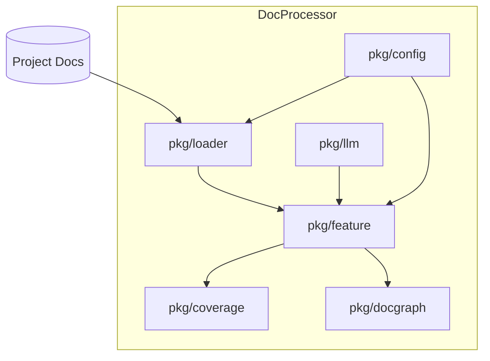
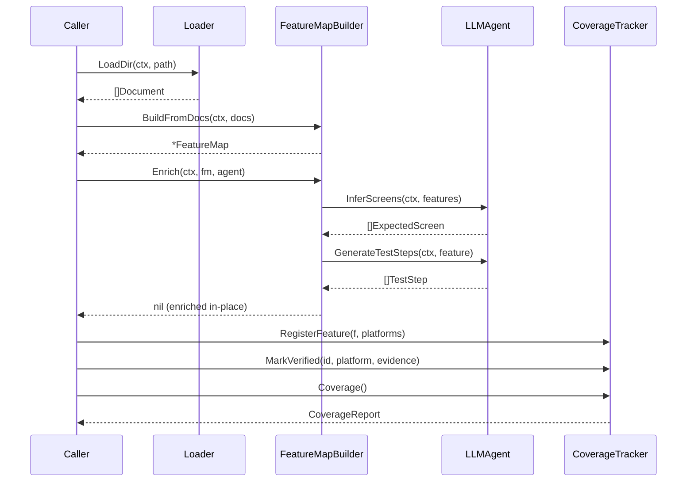
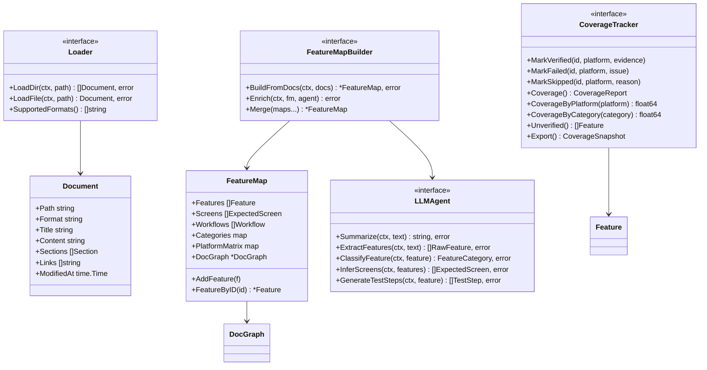
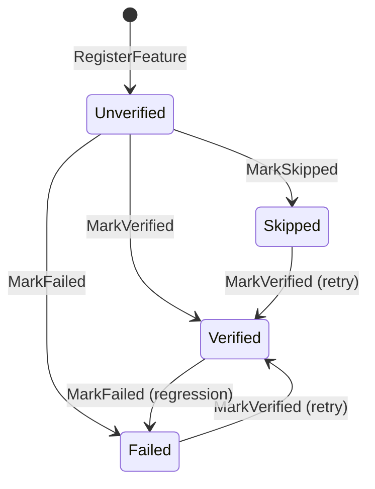
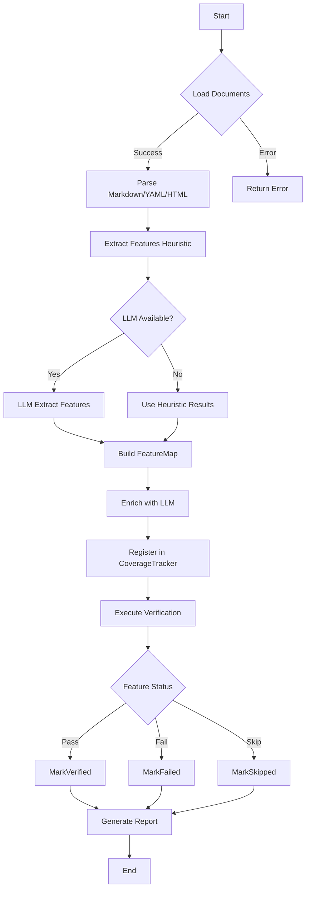

# Architecture

## Component Diagram



## Sequence Diagram



## Class Diagram



## State Diagram



## Flowchart



## Package Dependencies

```
config (no deps)
docgraph (no deps)
llm (no deps)
loader (yaml.v3)
feature (loader, llm, docgraph)
coverage (no internal deps)
```

## Thread Safety

The `CoverageTracker` implementation uses `sync.RWMutex` for concurrent access:
- Read operations (`Coverage()`, `CoverageByPlatform()`, `Unverified()`) use `RLock()`
- Write operations (`MarkVerified()`, `MarkFailed()`, `MarkSkipped()`) use `Lock()`

The `DocGraph` also uses `sync.RWMutex` for concurrent node/edge operations.

## Design Decisions

1. **LLMAgent is injected** -- No module-level dependency on LLMOrchestrator
2. **Feature IDs are deterministic** -- Same feature name produces same ID across runs
3. **Heuristic fallback** -- Feature extraction works without an LLM agent
4. **Prompt templates versioned** -- Trackable changes to LLM prompts
5. **MaxFileSize limit** -- 10 MB cap prevents OOM on large binary files
